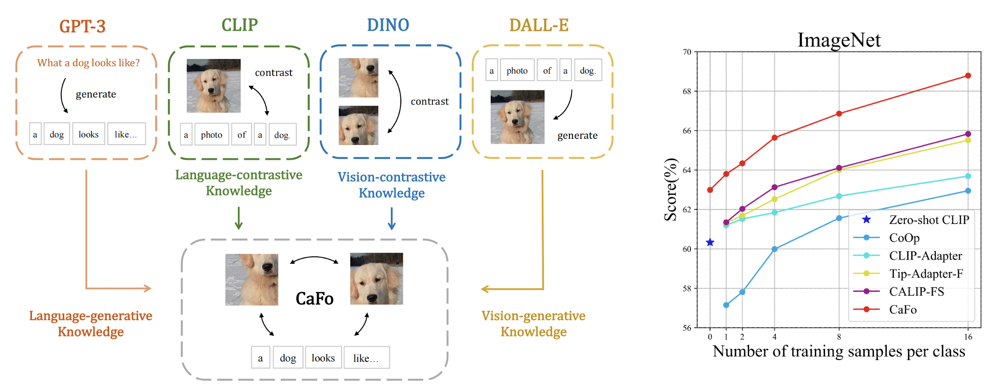

# Prompt, Generate, then Cache

Official implementation of ['Prompt, Generate, then Cache: Cascade of Foundation Models makes Strong Few-shot Learners'](https://github.com/ZrrSkywalker/CaFo/blob/main/CaFo_arXiv.pdf).

The paper has been accepted by **CVPR 2023** 🔥.

## News
* The CaFo model is developed based on [Tip-Adapter](https://arxiv.org/pdf/2207.09519), accepted by **ECCV 2022** and [open-sourced](https://github.com/gaopengcuhk/Tip-Adapter).

## Introduction
We propose **CaFo**, a **Ca**scade of **Fo**undation models that incorporates diverse prior knowledge of various pre-trianing paradigms for better few-shot learning, including CLIP, DINO, DALL-E, and GPT-3. Specifically, CaFo works by **`Prompt, Generate, then Cache'**. We leverage GPT-3 to prompt CLIP with rich linguistic semantics and generate synthetic images via DALL-E to expand the few-shot training data. Then, we introduce a learnable cache model to adaptively blend the predictions from CLIP and DINO. By such collaboration, CaFo can fully unleash the potential of different pre-training methods and unify them to perform *state-of-the-art* for few-shot classification.

  

## Code
Comming soon.

## Acknowledgement
This repo benefits from [Tip-Adapter](https://github.com/gaopengcuhk/Tip-Adapter), [CLIP](https://github.com/openai/CLIP), [DINO](https://github.com/facebookresearch/dino), [DALL-E](https://github.com/borisdayma/dalle-mini) and [CuPL](https://github.com/sarahpratt/CuPL). Thanks for their wonderful works.

## Contact
If you have any question about this project, please feel free to contact zhangrenrui@pjlab.org.cn.
